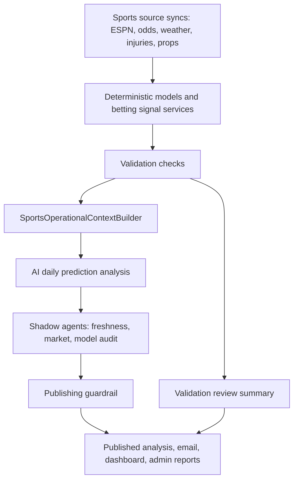

# Agents and Operations

This document describes the PickSports runtime agents, operations sentinels, and validation layers.

The goal is to make the system chargeable: data must be fresh, recommendations must be explainable, and risky outputs must be blocked before users see them.

## Operating Principle

Do not duplicate business logic in AI prompts.

Deterministic services own truth:

- ESPN and odds sync jobs own source data.
- Prediction actions own model outputs.
- Validation checks own data health.
- Betting signal services own deterministic scoring, thresholds, and market eligibility.
- AI agents review, explain, summarize, audit, and guardrail those canonical outputs.

AI should not decide whether a game is final, calculate model edge from scratch, invent injury context, infer missing odds, or override validation facts. AI can say what the facts mean, what outputs should be blocked, and what action should happen next.

## Current Agent Inventory

| Agent | Class | Trigger | Purpose | Output Location |
| --- | --- | --- | --- | --- |
| Daily prediction analysis | `SportsDailyPredictionAnalysisAgent` | `sports:ai-daily-predictions` | Turns deterministic prediction payloads into analysis, recommendation, risk flags, and market notes. | `sports_ai_prediction_analyses` |
| Data freshness review | `DataFreshnessAgent` | `sports:ai-daily-predictions` shadow chain | Audits freshness using `operational_context` and validation findings. | `sports_ai_prediction_analyses.metadata.shadow_agents.data_freshness` |
| Market readiness review | `MarketReadinessAgent` | `sports:ai-daily-predictions` shadow chain | Audits odds and market availability before publishing a pick. | `sports_ai_prediction_analyses.metadata.shadow_agents.market_readiness` |
| Model audit review | `ModelAuditAgent` | `sports:ai-daily-predictions` shadow chain | Checks whether model signal, confidence, edge, and reasons support the recommendation strength. | `sports_ai_prediction_analyses.metadata.shadow_agents.model_audit` |
| Publishing guardrail | `PublishingGuardrailAgent` | `sports:ai-daily-predictions` shadow chain | Decides whether an AI recommendation can publish as-is, be downgraded, held, or blocked. | `sports_ai_prediction_analyses.metadata.shadow_agents.publishing_guardrail` |
| Prediction narrative | `SportsPredictionNarrativeAgent` | Prediction narrative generation paths | Writes concise user-facing prediction narratives from supplied model data. | Prediction narrative fields/resources |
| Player prop narrative | `PlayerPropNarrativeAgent` | Player prop narrative generation paths | Writes player prop narratives from supplied model data. | Player prop recommendation payloads |
| Daily digest summary | `DailyDigestSummaryAgent` | Daily digest generation when enabled | Creates digest headline, intro, and highlights from supplied picks. | Daily digest email payload |
| Validation review summary | `ValidationReviewSummaryAgent` | `healthcheck:validate-data` when enabled | Summarizes validation findings, blocked outputs, trust score, and recommended actions. | `validation_runs.ai_summary` |

## Operations Sentinels

These are not AI agents, but they are operational agents and should be treated as part of the agent system.

| Sentinel | Command | Schedule | Purpose |
| --- | --- | --- | --- |
| Sport operations sentinel | `sports:operations-sentinel --sport={sport} --season={season}` | Daily per active sport before validation | Syncs yesterday/today/tomorrow scoreboards, refreshes recent player/team stats, recalculates team metrics, grades final predictions, then runs sport validation. |
| Data validation | `healthcheck:validate-data --sport={sport}` | Daily per sport before admin report | Persists validation findings, healthchecks, AI validation summary, and regression alerts. |
| AI publishing guardrail report | `sports:report-ai-publishing-guardrails` | Manual/reporting command | Compares saved AI classifications against guardrail classifications. |

## Canonical Flow



This matters because each layer has a different job:

- Source syncs collect facts.
- Models calculate predictions and edges.
- Validation detects bad or stale facts.
- Operational context carries validation facts into AI.
- AI analysis explains model output.
- Shadow agents challenge the analysis.
- Publishing guardrail controls whether the output is safe to show.

## No-Duplication Rules

Use these rules when adding or changing agents:

- Reuse `SportsAiPredictionPayloadBuilder` for prediction payloads.
- Reuse `SportsOperationalContextBuilder` for validation, freshness, pipeline, and publishing context.
- Reuse existing validation checks instead of adding prompt-only checks.
- Reuse betting signal services for deterministic score, threshold, and market logic.
- Add a validation check first when the issue is objectively detectable.
- Add an AI agent only when the system needs interpretation, summarization, prioritization, or publishing judgment.
- Store AI output as structured metadata; do not hide important decisions in prose.
- Keep recommended actions as executable artisan commands where possible.

## Validation Checks That Feed AI

Current validation checks are orchestrated by `SportValidator`:

- Game coverage
- Team stat coverage
- Current-day game data freshness
- Past scheduled game status
- Prediction completeness
- Odds completeness
- Injury freshness
- Player prop freshness
- Futures odds freshness
- Weather completeness
- Pipeline order
- Finalized data completeness

The AI layer should treat these findings as authoritative. For example, if `validation_past_scheduled_game_status` is failing for MLB, AI analysis should not publish a confident official MLB recommendation until the status drift is repaired.

## Publishing Policy

For a paid product, the default posture should be conservative:

- `passing` validation: recommendations can publish normally.
- `warning` validation: recommendations can publish as watchlist/lean with explicit caveats.
- `failing` validation: recommendations should be held, downgraded, or blocked.
- Missing market odds: no official bet.
- Stale odds: no official bet unless the deterministic market layer marks the edge as still usable.
- Missing final status/grading: block historical performance claims.
- Missing injuries/weather/player props where relevant: block high-confidence language.

`AI_PUBLISHING_GUARDRAILS_ENFORCED=false` currently keeps guardrails in shadow mode. For a paid system, move toward enabling enforcement after monitoring the guardrail report and confirming false positives are acceptable.

## Agent Details

### `SportsDailyPredictionAnalysisAgent`

Purpose: Generate structured betting analysis from a deterministic prediction payload.

Inputs:

- Prediction model output
- Market context
- Calculated edge
- Operational context

Outputs:

- `recommendation`
- `bet_classification`
- `ai_confidence`
- `analysis_confidence`
- `summary`
- `key_factors`
- `risk_flags`
- `reason_codes`
- `market_notes`

Rules:

- Do not invent data.
- Treat `operational_context` as authoritative.
- If publication guardrails are blocked, do not classify as official bet.

### `DataFreshnessAgent`

Purpose: Review whether the data behind a prediction is fresh enough to trust.

Outputs:

- `freshness_status`
- `trust_score`
- `latest_data_fresh_at`
- `stale_inputs`
- `missing_inputs`
- `blocked_outputs`
- `recommended_actions`

Use this to prevent stale scores, injuries, odds, weather, props, or validation failures from becoming confident recommendations.

### `MarketReadinessAgent`

Purpose: Review whether available markets support publication.

Outputs:

- `market_status`
- `readiness_score`
- `available_markets`
- `missing_markets`
- `risk_flags`
- `recommended_actions`
- `publishable_recommendation`

Use this to keep moneyline, spread, totals, futures, and prop recommendations honest when markets are missing or stale.

### `ModelAuditAgent`

Purpose: Challenge the strength of the model signal.

Outputs:

- `model_status`
- `signal_score`
- `confidence_alignment`
- `supporting_factors`
- `model_risk_flags`
- `reason_codes`
- `recommended_classification`

Use this to catch mismatches like strong prose on a weak edge, confidence that does not match model margin, or unsupported bet classifications.

### `PublishingGuardrailAgent`

Purpose: Make the final publishing decision.

Outputs:

- `decision`: publish, downgrade, hold, block
- `publishable_classification`
- `confidence`
- `reasons`
- `blocked_outputs`
- `required_actions`

This is the final AI safety layer. It should never create a stronger recommendation than the deterministic and validation layers support.

### `ValidationReviewSummaryAgent`

Purpose: Summarize a validation run for operators/admin reporting.

Outputs:

- `headline`
- `intro`
- `highlights`
- `recommended_actions`
- `latest_data_fresh_at`
- `data_schedule_today`
- `tweak_recommendations`
- `operational_status`
- `trust_score`
- `blocked_outputs`
- `safe_adjustments`
- `data_quality_notes`

This is the operator-facing AI layer. It should explain what is wrong, what is safe, what is blocked, and what command/action should happen next.

### Narrative and Digest Agents

`SportsPredictionNarrativeAgent`, `PlayerPropNarrativeAgent`, and `DailyDigestSummaryAgent` are user-facing copy agents.

They should only run after deterministic data and publishing guardrails are acceptable. They should not decide bet eligibility.

## Operations Sentinel Details

Command:

```bash
php artisan sports:operations-sentinel --sport=mlb --season=2026
```

Default behavior:

- Syncs scoreboards from yesterday through tomorrow.
- Refreshes recent game details so player stats, team stats, and plays stay current.
- Recalculates team metrics after the stat refresh.
- Grades ungraded final predictions for the season.
- Runs `healthcheck:validate-data --sport={sport}`.
- Fails if validation fails.

Manual recovery example:

```bash
php8.4 artisan sports:operations-sentinel --sport=mlb --from-date=2026-05-31 --to-date=2026-06-02 --season=2026
```

Stat refresh controls:

```bash
php8.4 artisan sports:operations-sentinel --sport=mlb --season=2026 --stat-lookback-days=5 --stat-limit=50
```

Use `--skip-stats` only when debugging the scoreboard/grade path and intentionally leaving player/team stats untouched.

Configured sports:

- `nba`
- `nfl`
- `mlb`
- `cbb`
- `cfb`
- `wcbb`
- `wnba`

Why this exists:

MLB has date and status risks because ESPN timestamps are UTC while the product needs local venue slate dates. The sentinel repairs and validates recent MLB data before AI analysis and admin reporting.

## Recommended Expansion

To make this system stronger as a paid product:

1. Add sport-specific overrides only when the generic scoreboard/grade/validate sentinel is not enough.
2. Keep expanding the shared `sports:operations-sentinel --sport=` wrapper instead of creating isolated repair commands.
3. Move guardrails from shadow to enforced once reports look stable.
4. Add an AI operations report that groups issues by severity and customer impact.
5. Add “do not publish” checks at the API/resource layer for failing validation states.
6. Track agent decisions over time so false positives and missed failures can be reviewed.
7. Add a customer-facing freshness indicator for premium users.

## Tests

Important tests:

- `tests/Feature/Sports/AiDailyPredictionsCommandTest.php`
- `tests/Feature/Sports/ReportAiPublishingGuardrailsCommandTest.php`
- `tests/Feature/Validation/HealthcheckValidateDataCommandTest.php`
- `tests/Feature/MLB/OperationsSentinelCommandTest.php`
- `tests/Feature/ESPN/MLB/FetchGamesFromScoreboardTest.php`
- `tests/Feature/ESPN/MLB/SyncGamesTest.php`

When adding a new agent, add tests for:

- structured output normalization
- blocked/degraded validation state
- missing/stale market data
- no hallucinated fields
- persistence location
- admin/reporting visibility
